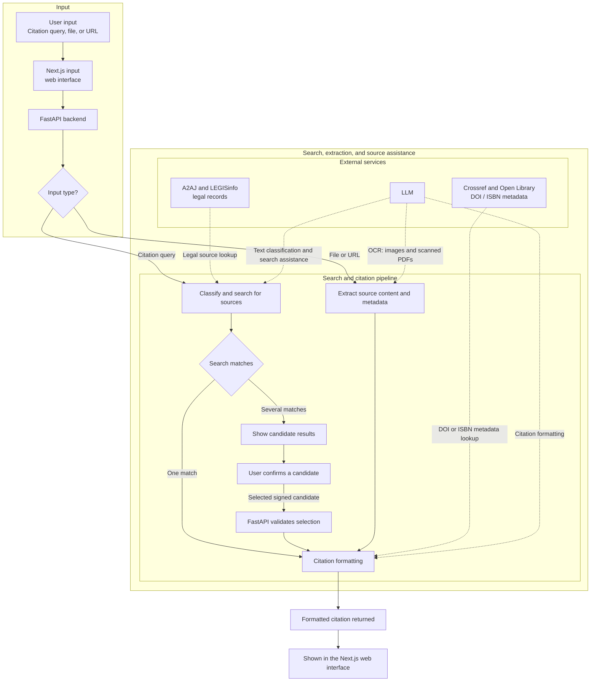

# Cite Counsel Web

Cite Counsel Web is an experimental web application that produces citations in the style of the *Canadian Guide to Uniform Legal Citation* (McGill Guide), 10th edition. It uses public metadata services, document extraction, and a language model to classify sources and format citations.

The repository is under active development. Treat every result as a research aid and check it against the source and the official McGill Guide before relying on it.

## Live demo

| | |
| --- | --- |
| Web app | [citecounsel.com](https://citecounsel.com) |
| API (Hugging Face Space) | [yubo47-mcgill-citation-api.hf.space](https://yubo47-mcgill-citation-api.hf.space) |
| API health check | [/api/health](https://yubo47-mcgill-citation-api.hf.space/api/health) |

## What is implemented

The browser application has three user flows:

| Flow | Implemented path | Important limits |
| --- | --- | --- |
| Citation search | A query is classified, searched, and either formatted directly or returned as signed candidates for the user to choose from. Case and legislation lookups primarily use A2AJ; federal bill lookup uses LEGISinfo. | Classification and most formatting require an LLM provider. Coverage is limited by the upstream services. A database match verifies source metadata, not the final McGill formatting. |
| URL, DOI, or ISBN | DOI metadata is resolved through Crossref; ISBN metadata through Open Library. Ordinary web pages are fetched and parsed before classification and formatting. | URL extraction does not execute JavaScript and rejects or fails on many blocked, dynamic, empty, or PDF URLs. DOI/ISBN lookup depends on upstream coverage. |
| File or image | The API accepts PDF, DOCX, PPTX, XLSX, JPG/JPEG, PNG, and WebP files, extracts available content, classifies the source, and formats a citation. | Images and scanned PDFs require Gemini vision; scanned PDFs use at most the first three rendered pages. Text extraction and model output can be incomplete or wrong. The default upload limit is 50 MB. |

When a search has several verified matches, the frontend asks the user to select one before formatting. Candidate payloads are HMAC-signed by the API and are rejected if altered.

A deterministic manual form also exists. It is disabled by default, must be enabled in both the frontend and the API, and marks its output as unverified.

## Architecture and request flow

A user enters a citation query, uploads a file, or submits a URL in the Next.js interface. FastAPI sends the request through search or extraction, formats the source details, and returns a citation to the browser. If a query has several matches, the user picks one before it is formatted.



The API also has health and warm-up checks, feedback collection, and a non-streaming chat endpoint. The frontend does not use the chat endpoint.

## External data sources

These services supply source records and metadata. They do not check that the final citation follows the Guide.

| Service | Used for | Credentials and limits |
| --- | --- | --- |
| A2AJ | Case and legislation searches and citation lookup/verification. | No API key is configured by this project. Coverage depends on A2AJ's available records. |
| LEGISinfo | Federal bill lookup and bill citation details. | Public endpoint; no API key configured. Federal bills only. |
| Crossref | DOI metadata for journal articles. | Public API; no API key configured. Depends on DOI registration and available metadata. |
| Open Library | ISBN metadata for books. | Public API; no API key configured. Depends on catalog coverage. |

## Technology stack

- Frontend: Next.js 16, React 19, TypeScript 5.7, Tailwind CSS 4, Base UI, Vitest, and Testing Library.
- Backend: Python 3.11, FastAPI, Uvicorn, and Pydantic.
- Extraction: trafilatura, pdfplumber, PyMuPDF, python-docx, python-pptx, and openpyxl.
- Integrations: A2AJ, LEGISinfo, Crossref, Open Library, Gemini, and an OpenAI-compatible text-completions service.

Key directories:

```text
frontend/       Next.js application and component tests
api/            FastAPI routes and request guards
core/           citation formatting, spend tracking, and persistence helpers
local_tools/    database adapters, URL guards, and file extraction
llm_api/        Gemini and compatible-completions clients
tests/          backend unit and contract tests
data/           static lookup data and ignored runtime records
```

## Local development

### Requirements

- Python 3.11+
- Node.js 20.9+ and npm

### Backend

From the repository root:

```powershell
python -m venv .venv
.\.venv\Scripts\Activate.ps1
python -m pip install -r requirements.txt
uvicorn api.main:app --reload --port 8000
```

On macOS or Linux, activate the environment with `source .venv/bin/activate`.

The health endpoint is `http://localhost:8000/api/health`.

### Frontend

In a second terminal:

```powershell
cd frontend
npm ci
npm run dev
```

Open `http://localhost:3000`. Unless overridden at build time, the frontend calls `http://localhost:8000`.

## Configuration

Put backend settings in the root `.env` file or in deployment secrets. Git ignores `.env`. Never expose private keys through `NEXT_PUBLIC_` variables. The repository has no checked-in environment example.

For text completions, the code takes one key for the configured OpenAI-compatible endpoint (`LLM_API_KEY`; `OPENROUTER_API_KEY` is also accepted). Set `LLM_COMPLETIONS_URL` to choose the endpoint and `LLM_DEFAULT_MODEL` to choose its model. The default endpoint is DeepSeek direct, which requires `DEEPSEEK_API_KEY` instead. This setting covers fallback search assistance and citation formatting. It does not configure image understanding.

The query classifier calls Gemini text, and image or scanned-PDF extraction calls Gemini Vision. Both use `GEMINI_API_KEY`, so a standard setup that needs these paths requires its own Gemini key. A text-only compatible model cannot do the vision and OCR work, and the repository has no generic multimodal endpoint for those file paths. `GEMINI_TEXT_MODEL` and `GEMINI_VISION_MODEL` optionally override the Gemini model names. Deployment settings include `NEXT_PUBLIC_API_BASE_URL`, `ALLOWED_ORIGINS`, and a stable `CANDIDATE_SIGNING_KEY`; see the deployment notes below.

## Verification

Run the backend and frontend checks from the repository root:

```powershell
python -m pytest

cd frontend
npm test
npm run lint
npm run build
```

Backend tests live in `tests/`. Provider integrations are mostly mocked, so passing tests say nothing about whether the live services are up.

## Deployment

The root Dockerfile runs the FastAPI backend on port `7860`. Deploy the Next.js app separately and set `NEXT_PUBLIC_API_BASE_URL` to the backend URL. Set `ALLOWED_ORIGINS` to the frontend origin, and use a stable `CANDIDATE_SIGNING_KEY` when running multiple workers. To run a local container:

```powershell
docker build -t cite-counsel-api .
docker run --rm -p 7860:7860 --env-file .env cite-counsel-api
```

[`api_contract.md`](api_contract.md) documents more backend settings and routes. The API has no authentication, and its rate limits apply per process.

## API response contract

Application routes return the same JSON envelope:

```json
{
  "ok": true,
  "route": "bill",
  "status": "done",
  "data": {},
  "debug": null,
  "error": null
}
```

`status` can be `done`, `needs_selection`, `needs_input`, `unsupported`, or `error`. See `api_contract.md` for the route-level contract.

## Legal and project status

This project does not include or replace the McGill Guide, a separate copyrighted publication that remains the authority on its rules.

The project's code is under the [MIT License](LICENSE). The license does not cover the McGill Guide.
